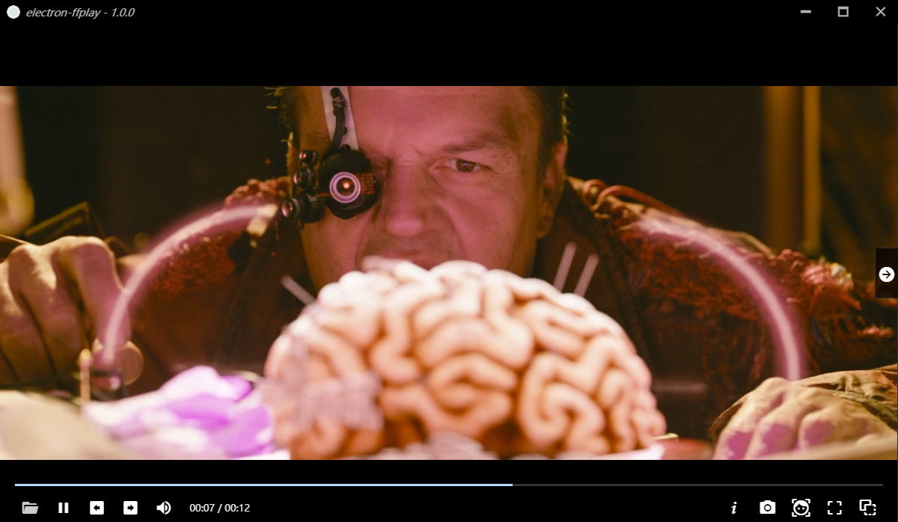

# Simple video player using electron & ffplay (as node addon)



# build
```bash
# build ffmpeg according to https://github.com/ShiftMediaProject
# build using x64/Release mode
# suppose all sources are at D:\some_dir\src\{FFmpeg,...}

# get electron-ffplay source
cd electron-ffplay

# build addon
cd node-ffplay
mkdir build
cd build
cmake -G "Visual Studio 15" -A x64 .. -DFFMPEG_SRC_DIR=D:\some_dir\src\FFmpeg
cmake --build . --config Release
cd ../..

# install dependencies
npm i

# run 
npm run dev

``` 
